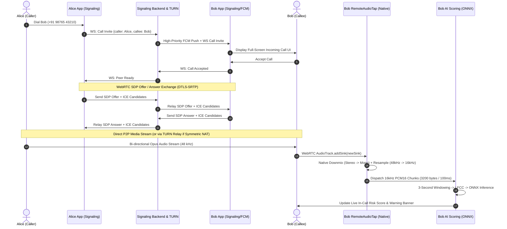

# Production Architecture & Implementation Plan: VoiceGuard VoIP
 
> **Target:** Transform VoiceGuard from an emulator-bound POC into an end-to-end, resilient, production-grade VoIP calling application with real-time AI voice-clone detection.
 
---
 
## 1. Executive Summary & Forensic Gap Analysis
 
Deep research into the existing codebase reveals five architectural chasms preventing real-world operation. Below is the forensic comparison between current state and production requirements:
 
| Dimension | Current State in Codebase | Production Requirement |
| :--- | :--- | :--- |
| **Signaling & Host** | Hardcoded default to `10.0.2.2:8001` (`signaling_service.dart#L21`); server docs say port 8000; requires matching 4-digit room codes manually typed on both devices simultaneously. | Dynamic host discovery / user settings; user directory & identity (phone number / user ID); stateful call session management (`INVITE`, `RINGING`, `ACCEPT`, `DECLINE`, `BYE`); FCM background push wake-up. |
| **NAT Traversal** | Only public Google STUN (`stun:stun.l.google.com:19302`). Fails unconditionally across 4G/5G mobile carriers using Symmetric NAT (CGNAT). | Dynamic ICE server configuration with authenticated TURN relays (e.g. `coturn`, LiveKit, or Twilio Network Traversal) over UDP/TCP/TLS (port 443 fallback). |
| **Audio Resampling** | `RemoteAudioTap.kt#L32` dumps native WebRTC buffers (48 kHz / stereo) straight into Dart; `AudioProcessor` assumes 16 kHz mono. Frequencies squashed 3x, rendering LFCC/feature extraction invalid. | High-performance native Kotlin audio resampler (48 kHz → 16 kHz downsampler + stereo downmix) with bounded ring buffer before dispatching to Flutter isolate. |
| **OS Call Lifecycle** | In-app view only (`protected_call_screen.dart`). No background execution, no lock-screen incoming call UI, no audio focus arbitration with carrier calls. | Android Self-Managed `ConnectionService` (`MANAGE_OWN_CALLS`) or `CallStyle` foreground service; proximity sensor screen management; native audio routing (Earpiece / Speakerphone / Bluetooth SCO). |
| **Testing & Robustness** | 10-line unit test (`webrtc_call_service_test.dart`) testing a single static boolean function. | Automated signaling unit tests, mock WebRTC loopback integration tests, and network impairment simulation using Module A (`TeleChannel`). |
 
---
 
## 2. End-to-End System Architecture
 

 
---
 
## 3. Detailed Engineering Phases
 
### Phase 1: Signaling & User Directory Architecture
 
#### 1.1 Backend: State-Machine Signaling Relay (`voice_guard/backend/signaling.py`)
Replace the simplistic room relay with a session-aware SIP-lite signaling router:
- **Client Registration:** Clients register on WebSocket connect with an authenticated User ID / Device Token:
  ```json
  {"action": "register", "userId": "alice_device_1", "apiKey": "vg_demo_key"}
  ```
- **Session State Machine:**
  - `CALL_INVITE`: Caller initiates call to a target `calleeId`.
  - `CALL_RINGING`: Callee acknowledges incoming call.
  - `CALL_ACCEPT`: Callee accepts; SDP negotiation begins.
  - `CALL_REJECT`: Callee rejects / busy.
  - `CALL_HANGUP`: Either peer terminates; session resources cleaned.
  - `ICE_CANDIDATE`: Relays trickle ICE candidates.
- **Heartbeat & Reconnection:** 30s ping/pong keepalive. If a peer drops for < 10s, permit ICE restart without tearing down the session.
 
#### 1.2 Frontend: Configurable Host & Client State Machine
- **Settings Integration:** Add `signalingServerUrl` to `SettingsProvider` with persistence via `SharedPreferences`. Default to production server, but allow manual LAN IP entry for local hackathon testing.
- **Call Controller:** Implement `VoipCallManager` managing transitions: `idle` → `outgoingRinging` → `connecting` → `active` → `ended`.
 
---
 
### Phase 2: NAT Traversal & Carrier-Grade Connectivity (STUN/TURN)
 
#### 2.1 The Mobile Carrier Constraint
Mobile networks (Jio, Airtel, Vodafone, US carriers) employ **Carrier-Grade NAT (CGNAT) with Symmetric port mapping**. A STUN server alone is structurally incapable of binding ports across two mobile devices on different cell towers.
 
#### 2.2 TURN Server Deployment & Ephemeral Token API
- **Deployment:** Deploy `coturn` on a public VPS with ports:
  - UDP/TCP `3478` (Standard STUN/TURN)
  - TCP `443` (TLS TURN fallback to penetrate enterprise/guest Wi-Fi firewalls)
- **Backend API Endpoint:** Add `/v1/webrtc/ice-servers` to `backend/main.py` implementing the standard HMAC-SHA1 time-limited credential mechanism:
  ```python
  @app.get("/v1/webrtc/ice-servers")
  async def get_ice_servers(user: str = Depends(verify_api_key)):
      ttl = 3600
      timestamp = int(time.time()) + ttl
      username = f"{timestamp}:{user}"
      credential = base64.b64encode(hmac.new(TURN_SECRET.encode(), username.encode(), hashlib.sha1).digest()).decode()
      return {
          "iceServers": [
              {"urls": ["stun:stun.l.google.com:19302"]},
              {"urls": [f"turn:{TURN_HOST}:3478?transport=udp", f"turns:{TURN_HOST}:443?transport=tcp"],
               "username": username,
               "credential": credential}
          ]
      }
  ```
- **Client Integration:** Fetch ICE configuration dynamically in `WebRtcCallService.startCall()`.
 
---
 
### Phase 3: Native Audio Processing & Resampling Engine
 
#### 3.1 The 48 kHz → 16 kHz Resampling Imperative
WebRTC natively decodes Opus streams at **48,000 Hz** (or 44,100 Hz), stereo or mono. The AI model and feature extractor strictly expect **16,000 Hz 16-bit Mono PCM**.
 
#### 3.2 Kotlin Native Downsampler in `RemoteAudioTap.kt`
Instead of piping raw bytes across the Flutter EventChannel, do high-performance downmixing and resampling on the native thread:
 
```kotlin
class AudioResampler16k(private val onChunkReady: (ByteArray) -> Unit) {
    private val outChunkSize = 3200 // 100ms @ 16kHz mono 16-bit
    private val chunkBuffer = ByteArray(outChunkSize)
    private var chunkPos = 0
 
    fun processAudio(
        buffer: java.nio.ByteBuffer,
        sampleRate: Int,
        channels: Int,
        frames: Int
    ) {
        val shortBuf = buffer.asShortBuffer()
        val inSamples = shortBuf.remaining()
        if (inSamples == 0) return
 
        val step = sampleRate.toDouble() / 16000.0
        var inIndex = 0.0
 
        while (inIndex < frames) {
            val frameIdx = inIndex.toInt()
            var sample = 0
            if (channels == 1) {
                sample = shortBuf.get(frameIdx).toInt()
            } else if (channels == 2) {
                val left = shortBuf.get(frameIdx * 2).toInt()
                val right = shortBuf.get(frameIdx * 2 + 1).toInt()
                sample = (left + right) / 2
            }
 
            // Write 16-bit little-endian
            chunkBuffer[chunkPos++] = (sample and 0xFF).toByte()
            chunkBuffer[chunkPos++] = ((sample shr 8) and 0xFF).toByte()
 
            if (chunkPos >= outChunkSize) {
                val output = chunkBuffer.copyOf()
                onChunkReady(output)
                chunkPos = 0
            }
 
            inIndex += step
        }
    }
}
```
**Benefits:**
- Eliminates 3x frequency warping before LFCC extraction.
- Groups 10ms-20ms WebRTC callbacks into 100ms chunks, reducing Flutter platform-channel message frequency by 80%.
 
---
 
### Phase 4: Native Android OS Calling Lifecycle (`ConnectionService`)
 
#### 4.1 Android Telecom Integration
VoiceGuard already declares `android.permission.MANAGE_OWN_CALLS` in `AndroidManifest.xml`.
1. **Self-Managed `ConnectionService`:** Implement `VoipConnectionService : ConnectionService`.
2. **Register PhoneAccount:**
   ```kotlin
   val telecomManager = getSystemService(TelecomManager::class.java)
   val componentName = ComponentName(this, VoipConnectionService::class.java)
   val phoneAccountHandle = PhoneAccountHandle(componentName, "VoiceGuardVoip")
   val phoneAccount = PhoneAccount.builder(phoneAccountHandle, "VoiceGuard Secure Call")
       .setCapabilities(PhoneAccount.CAPABILITY_SELF_MANAGED)
       .build()
   telecomManager.registerPhoneAccount(phoneAccount)
   ```
3. **Lock-Screen Incoming Call:** When an incoming call arrives, notify `TelecomManager.addNewIncomingCall()`. Android displays system-native incoming call heads-up notification with "Answer" and "Decline" actions, even if phone is locked.
4. **Audio Routing:** Handle proximity sensor (blank screen when near ear), earpiece routing (`CallAudioState.ROUTE_EARPIECE`), speakerphone (`CallAudioState.ROUTE_SPEAKER`), and Bluetooth headset (`CallAudioState.ROUTE_BLUETOOTH`).
 
---
 
### Phase 5: In-Call AI Shield & Alert UX
 
1. **Deterministic Alert Policy:**
   - EMA smoothing: $\alpha = 0.35$.
   - Pre-condition: Minimum 3 seconds of valid speech signal before evaluation (implemented in `AudioService.dart`).
   - Alert condition: Risk score $> 0.70$ across 2 consecutive 1-second analysis cycles.
2. **In-Call Visual & Haptic Alerts:**
   - Real-time in-call HUD: Floating banner changing from Emerald ("Verified Human") to Amber ("Suspicious") to Crimson ("Synthetic Clone Detected").
   - Haptic feedback: Subtle vibration pattern on device when score exceeds danger threshold.
   - Forensic Audio Dump: When a call is flagged as synthetic, capture the preceding 5-second PCM segment to internal cache for audit inspection in `LogsScreen`.
 
---
 
### Phase 6: Testing & Validation Matrix
 
1. **Unit Testing:**
   - Signaling message serialization / deserialization.
   - WebRTC SDP offer/answer state transitions.
   - Resampler audio integrity: Verify 48 kHz sine wave input produces 16 kHz sine wave output without aliasing.
2. **Network Impairment Testing (TeleChannel Module A Integration):**
   - Inject bursty packet loss (via `packetloss.py`) and Opus transcoding into the stream to evaluate detector resilience under fluctuating jitter and loss.
3. **Hardware Matrix Testing:**
   - Physical device to physical device over 4G/5G mobile data.
   - Physical device to emulator across local Wi-Fi.
   - Audio route switching (Earpiece ↔ Speaker ↔ Bluetooth headset) during an active live call.
 
---
 
## 4. Implementation Work Breakdown
 
| Task # | Component | Action Description | Target File(s) |
| :---: | :--- | :--- | :--- |
| **1** | Native Audio | Implement `AudioResampler16k` in `RemoteAudioTap.kt` with stereo downmix & 48kHz→16kHz resampling. | `android/.../RemoteAudioTap.kt` |
| **2** | Backend Signaling | Upgrade `signaling.py` to stateful VoIP router + add `/v1/webrtc/ice-servers` endpoint. | `backend/signaling.py`, `backend/main.py` |
| **3** | Client Config | Add configurable signaling/API host in `SettingsProvider` and UI toggle in `SettingsScreen`. | `lib/providers/settings_provider.dart`, `lib/screens/settings_screen.dart` |
| **4** | WebRTC Client | Refactor `SignalingService` and `WebRtcCallService` for dynamic ICE servers and call state machine. | `lib/services/signaling_service.dart`, `lib/services/webrtc_call_service.dart` |
| **5** | In-Call UI/UX | Enhance `ProtectedCallScreen` with dialer pad, contact selection, in-call audio toggles, and live alerts. | `lib/screens/protected_call_screen.dart` |
| **6** | Verification | Write automated loopback tests and verify audio fidelity via forensic WAV export. | `test/webrtc_call_service_test.dart` |