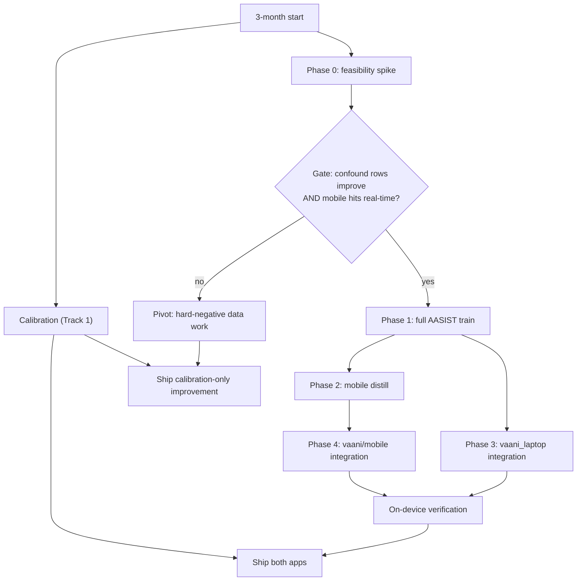
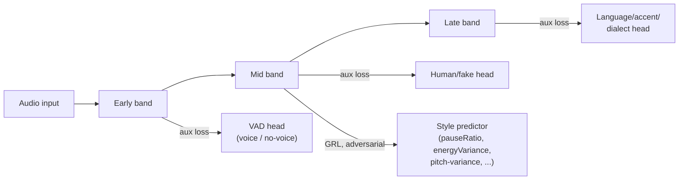

# VAANI model architecture brainstorm

Living brainstorm doc, one idea per top-level section, added to across sessions.
Also maintained as a Claude Doc for inline comments/collaboration:
https://claude.ai/code/artifact/a3be9e1f-25e2-48c6-827f-ba84eb43e330

---

# Idea 1: Laptop/Mobile Model Architecture Split — Cost-Benefit

As of 2026-09-17.

## Current state (corrects the starting premise)

There are not currently two working models to split apart. Only one real, trained model exists today.

| Component | What it actually is today |
| --- | --- |
| `voice_guard` (Flutter mobile app) | Real, deployed model: **v13**, a frame-level SeqTCN over LFCC sequences + 6 physiological scalars (pauseRatio, energyVariance, zcrVariance, jitter, shimmer, hnr_db). Deployed 2026-09-17 by explicit user override, despite failing its own confound gate. |
| `vaani/mobile` (separate Flutter app, `org.vaani.mobile`) | No trained model. `OnnxScorer` loads `identity_model.onnx`, a placeholder test fixture, fed a zero-filled tensor. Code comments mark it as waiting on "Module B's real exported model," which has not landed. |
| `vaani/app` (Python Streamlit/FastAPI PC diagnostic UI) | No trained model. Wired to `MockBackend`, also waiting on the same unshipped Module B model. |

So "both models hallucinate" isn't quite right — one model hallucinates (documented, measured); the other two client apps have no model to hallucinate with yet.

### The hallucination is a known, named, actively-worked bug

`voice_guard/docs/CRITICAL-entity-vs-style-confound.md` (2026-09-11) found and quantified that the model detects speaking **style** (how much pacing/energy/pitch vary) rather than speaker **entity** (human vs. AI). A human in a controlled/monotone register gets false-flagged; a fake with natural pacing slips through — confirmed live on-device and on held-out data. It proposed three remediation tracks, ranked by cost:

| Track | Approach | Status |
| --- | --- | --- |
| 1. Per-speaker calibration | Score deviation from a captured per-speaker baseline, not a fixed global threshold | **Not attempted** |
| 2. Add physiological features | jitter, shimmer, HNR alongside existing prosodic features | Tried (`v10_physio`) — did not close the confound |
| 3. Frame-level sequence model | Raw/frame-level LFCC sequence through a SeqTCN instead of a pooled-vector MLP | Tried (`v11`–`v13`) — cut headline EER roughly in half (0.49 → 0.31), confound gate still fails 9 of 14 rows in every version shipped so far |

The practical upshot: the two most expensive remediation tracks — more features, then more model capacity — have both already been spent on this exact model, and both left the specific hallucination mechanism intact. That's the baseline this proposal has to beat, not a green field.

## Proposed architecture

Two client apps, one shared data/eval pipeline, model family decided by a feasibility spike rather than assumed up front.

- **`vaani_laptop`** (rename of `voice_guard`): becomes the PC diagnostic UI, replacing `vaani/app`'s currently mock-backed Streamlit/FastAPI interface. Runs the large model **locally** (laptop-class CPU/GPU), cloud hosting deferred as a future option, not built in this scope — avoids taking on hosting infra and DPDP data-leaving-device compliance work (the `vaani/tests/legal` DPDP consent/revocation framework already exists specifically to gate audio leaving a device; a real hosted cloud service would need to run through it, a local model doesn't).
- **`vaani/mobile`**: becomes the primary mobile app. Its `OnnxScorer` stops pointing at the `identity_model.onnx` placeholder and gets a real trained small model — this is also the first time "Module B" actually ships into this app, not just a rename.
- **Shared underneath both**: the existing TeleChannel channel-degradation pipeline (`vaani/telechannel/configs/channels.yaml`), the corpus, the `select`/`test` split discipline, and the four-gate `evaluate.py` protocol. These are architecture-agnostic — they operate on raw audio and don't care whether the model consuming it is an MLP, a SeqTCN, or a raw-waveform network. Switching feature extraction only touches `dataset.py`'s feature step and the model class; the hard-won correctness infrastructure carries over unchanged.

**Open by design at this point:** whether the laptop and mobile models share one architecture family (large model full-size, mobile a distilled/pruned version) or diverge into two separate designs. Real-time latency, model-size and battery budget on target Android hardware aren't known yet — this doc treats that as the first thing to establish, not an assumption (see Phased plan, below).

The `voice_guard → vaani_laptop` rename itself is a separate, low-risk, bounded task (path/package renames, asset references, CI if any) independent of which model architecture gets chosen — it doesn't block or get blocked by the model work and could happen on its own timeline.

## Approaches considered

| | A: AASIST-family backbone | B: SSL fine-tune + classical features | C: Calibration only (track 1) |
| --- | --- | --- | --- |
| What it is | Raw-waveform + SincNet frontend + spectro-temporal graph attention, purpose-built for anti-spoofing generalization. Laptop gets it full-size; mobile gets a distilled/pruned/quantized version — pending the feasibility spike. | Laptop: fine-tune a pretrained wav2vec2/WavLM backbone (90M+ params) as the large model. Mobile: refined classical features (LFCC kept, MFCC/LPC/LSP/delta added, VAD-based snippet selection instead of "compressed sensing") on roughly the current architecture family. | Keep the current `v13` SeqTCN as-is. Add per-speaker relative scoring: brief on-device baseline capture, score subsequent audio as deviation from that speaker's own norm rather than a fixed threshold. No new model architecture. |
| Architecture novelty | Low-to-moderate — adapting a published, purpose-built design to this corpus/pipeline, not inventing one. | Low on laptop (transfer learning); the mobile-side feature work is genuine but same family as what already failed (LFCC/physio). | None. |
| Plausibility of closing the confound | **Higher** — targets vocoder-artifact-level signal (phase discontinuities, formant-transition smoothness) that no pooled cepstral statistic exposes; this is specifically why the anti-spoofing literature moved to this family. | **Low on the mobile side** — MFCC/LPC/LSP are the same representational family as LFCC+physio, which state.md already documents didn't fix it. SSL embeddings on the laptop side are more promising than classical features but still unproven against this specific confound. | Doesn't fix the representational ceiling, only compensates for it per-speaker. A naturally low-variance speaker still needs to be "calibrated in." Cheapest and fastest to ship, lowest ceiling on how far it can go. |
| Rough engineering effort (3-month budget) | High: new frontend, retrain per phone-channel recipe already in the pipeline, confound-gate re-evaluation, mobile distillation as its own workstream. | Laptop: moderate (fine-tuning is well-trodden). Mobile: low-to-moderate, but plausibly wasted effort per the plausibility row above. | Low: mostly app-side UX (baseline capture flow) + a scoring-layer change, no retraining pipeline needed. |
| Mobile feasibility risk | Real and unresolved — full raw-waveform + graph attention at real-time on a phone CPU is unverified; a distillation/quantization pass would be its own scoped task. | Lower risk technically (classical features are already proven feasible on this hardware), but risks spending mobile effort on a lever already shown not to work. | Lowest — runs on top of whatever model already ships. |

A fourth option — do nothing architectural and just keep iterating v13's existing SeqTCN on data/regularization levers (the `post-v13 rework` already in flight: CMVN, SpecAugment, mixup, focal loss) — isn't listed as a full approach because it's already the team's current default path, not a new decision; it's the implicit baseline every approach above is measured against.

## Recommendation

**Approach A (AASIST-family backbone) for the laptop model, plus Approach C (per-speaker calibration) layered on top of whatever ships, on both apps.** Not Approach B's classical-feature path — MFCC/LPC/LSP/delta are the same representational family as the physiological features already shown not to fix this (`v10_physio`), so spending mobile-side effort there is the lowest-expected-value use of the 3 months, not a genuinely different attempt. SSL fine-tuning (the other half of B) is a reasonable fallback for the laptop model specifically if A stalls, but AASIST is purpose-built for this exact generalization failure and is small enough to plausibly serve both apps, so it's the better first bet.

Calibration (C) is not a consolation prize — it's cheap, orthogonal, and helps regardless of which model family wins, so it should ship early and in parallel, not be treated as the fallback if A fails.

### Is this the most efficient path? — explicit verdict

**Partially, with one gate that should come before committing the full 3 months.** Two corrections change the calculus from how the idea was originally framed:

1. **The current model already detects TTS and voice conversion, imperfectly, not "can't."** v13's attack-type head passes its gate (MLAAD TTS share 76.6%, leave-attack-out balanced accuracy 0.75); MLAAD false-negative rate was 40.4% for v12 (the last measured number), down from v11's 53.7%. The gap is real but it's a miss-rate problem, not zero capability — and it's plausibly the *same* entity-vs-style confound expressed on the fake side (v13's fake-side confound rows are exactly where it still fails). That means closing the confound is likely to move TTS/clone detection too, not a separate problem needing separate work.
2. **The riskiest unknown isn't the architecture, it's whether this confound is representational or data-driven at all.** Two rounds of representational upgrades (more features, more capacity) both failed to close it. AASIST is a genuinely different representation, which is why it's recommended — but if it *also* fails to close the confound gate, that's evidence the bug is in the training data (not enough hard negatives: monotone real speech, naturally-paced fakes) rather than in any model architecture, and no further architecture spend would be efficient.

**So the efficient version of this plan is gated, not committed up front:** run a scoped early spike (small-scale AASIST trained on the existing corpus, scored through the existing `measure_confound.py`/`evaluate.py` gates) before committing to the full build-out on both apps. If it closes the gate, proceed with the full 3-month plan below. If it doesn't, redirect the remaining budget toward corpus/hard-negative work instead of a bigger model — that pivot is cheap to make early and expensive to discover in month three.

## Budget: where the 3 months actually goes

Rough phase-level time budget for the recommended path (spike → AASIST → calibration → both app integrations), assuming solo development at AI-assisted coding speed, not a committed schedule:

| Phase | Est. time | Compute/data need | Go/no-go criterion |
| --- | --- | --- | --- |
| 0. Feasibility spike | 1–2 weeks | Existing corpus, small-scale AASIST run, one Android test device | Confound-gate rows improve meaningfully AND on-device latency is real-time-viable → proceed; either fails → redirect per Recommendation section |
| 1. Full AASIST training (laptop) | 3–5 weeks | Reuse existing TeleChannel/corpus pipeline; GPU for training (existing training box) | Passes the same four-gate `evaluate.py` protocol already in use |
| 2. Mobile distillation/quantization | 2–3 weeks | Contingent on phase 0; separate workstream if divergent architectures needed | Real-time inference on target hardware within battery/latency budget |
| 3. `vaani_laptop` app integration | 1–2 weeks | None beyond dev time | Replaces `vaani/app`'s `MockBackend` with real scores end-to-end |
| 4. `vaani/mobile` app integration | 1–2 weeks | None beyond dev time | Replaces `identity_model.onnx` placeholder with real scores end-to-end |
| 5. Per-speaker calibration (both apps) | ~1 week, run in parallel early | None beyond dev time | Ships independent of model-family outcome |

That totals 9–15 weeks against a ~12-week budget — plausible but not slack-heavy, and optimistic against this project's own history: closing the confound has already taken three training rounds (`v11`→`v12`→`v13`) without succeeding, so phase 1's 3–5 weeks assumes AASIST needs meaningfully fewer iteration cycles than the SeqTCN work did — true if the representational hypothesis is right, not guaranteed.

**Expected benefit, quantified from this project's own trajectory:** headline EER has already improved from 0.51 (v9) → 0.49 (v11) → 0.32 (v13) across the representational upgrades tried so far. A materially different representation (AASIST) landing further gains on raw EER is a reasonable bet even independent of the confound question. The confound-specific gain (fixing the false-flag/miss-flag mechanism itself, not just aggregate EER) is the genuinely uncertain part — it has resisted two prior representational changes, so treat any confound improvement from this path as a hypothesis being tested, not an expected outcome to plan around.

## Phased plan with decision gates

Calibration ships on its own track regardless of which branch the gate takes — it's cheap enough not to wait on the architecture decision.

**The gate's pass criteria should be concrete, not a feeling:** re-run the existing `measure_confound.py` rows (the same ones v11–v13 have been scored against) and require the spike model to pass materially more than the current 5-of-14, not just "looks better." For mobile real-time: `EVAL-PROTOCOL.md`'s own windowing rule already sets the bar — the app scores a 3 s window every second, so inference has to comfortably clear well under 1 second per window on target hardware, not just complete eventually. Reusing these existing, already-calibrated thresholds (rather than inventing new success criteria for this project) keeps the gate honest and comparable to the project's own history.

## Risks, open questions, what would change this recommendation

- **`vaani/mobile`'s existing ONNX contract doesn't match `voice_guard`'s model at all.** `OnnxScorer` expects an input named `mel`, shape `[1, 48, 10]`. `voice_guard`'s deployed `v13` contract is `lfcc_sequence` `[1, 184, 60]` + `scalars` `[1, 6]` → `real_fake_logits`/`attack_type_logits`. Whatever ships to `vaani/mobile` — AASIST, SSL, or anything else — needs either to match the existing `mel_bridge.dart`/`window_pipeline.dart` contract or those files need to change too. Don't assume "drop in the new model" is a small step; check this before phase 4.
- **Two other known gaps are orthogonal to the entity-vs-style confound and won't be fixed by any architecture change alone:** accent cells (`en_native`, `hi_native`, etc.) sit at chance for every model version tried so far — this reads as a data-coverage gap (Hindi has far less training data than English), not a representational one. Unseen-channel generalization (`gsm_2g`, `tandem_xnet`) is similarly weak across the board. Neither should be expected to improve as a side effect of the AASIST work; they'd need their own data/coverage effort.
- **Training cadence risk:** each of `v11`→`v12`→`v13` took real multi-day sessions with iteration on failed gates. A new architecture may need a similar number of iteration cycles before it's trustworthy — confirm GPU/compute availability can sustain that cadence before committing to the phase-1 timeline.

**What would change this recommendation:**
- Spike shows AASIST (even distilled/quantized) can't hit real-time on target Android hardware → keep mobile on the current/refined classical pipeline, spend laptop-only effort on AASIST or SSL, and accept a laptop/mobile accuracy gap rather than force a shared architecture.
- Spike shows the confound gate doesn't move even on the laptop-scale model → stop spending on architecture entirely; redirect remaining budget to corpus/hard-negative collection (monotone real speech, naturally-paced fakes), since that would be strong evidence the bug is in the data, not the representation.

---

# Idea 2: Spiking Neural Networks vs. other alternatives

As of 2026-09-17.

## Short answer

SNNs are not a good fit for this project right now — not because the
representational idea is bad in the abstract, but because every practical
precondition for SNNs paying off is absent here, and the reasons are almost
entirely deployment/tooling, not modeling.

## What would have to be true for SNNs to earn their keep

| Precondition | SNN's actual selling point | This project's reality |
| --- | --- | --- |
| Neuromorphic or event-driven hardware target (Loihi 2, Akida, SynSense) | Spiking layers only realize their claimed power/latency advantage on hardware built for asynchronous spike events | Both deployment targets are conventional von Neumann hardware — the phone (Android CPU, ONNX Runtime) and the laptop. Simulated on ordinary silicon, a spiking layer is just a recurrent network run for T timesteps — no efficiency win, likely worse latency than the current SeqTCN. |
| Mature export path to the runtime this pipeline already committed to | — | ONNX has no native spiking-neuron op set; snnTorch/SpikingJelly/Lava models don't export cleanly to ONNX Runtime. Idea 1's proposed architecture leans hard on one shared ONNX pipeline across `vaani_laptop` and `vaani/mobile` — an SNN would break that, needing its own runtime (e.g. Lava, Loihi SDK) on top of everything else being built. |
| A mechanistic reason to expect it closes the entity-vs-style confound | Biologically-inspired temporal spike-timing coding | No anti-spoofing literature precedent. SNNs are proposed for energy/latency, not for exposing vocoder-specific artifacts (phase discontinuities, formant-transition smoothness) — the exact signal AASIST/raw-waveform CNNs target and pooled cepstral stats miss (`docs/CRITICAL-entity-vs-style-confound.md` §3). |
| Stable, well-trodden training recipe | — | Surrogate-gradient training is materially less mature than standard backprop; this project has already burned three training rounds (`v11`→`v12`→`v13`) on a conventional architecture without closing the confound — adding training-method risk on top of representation risk is the wrong lever to pull right now. |

Every row fails, and they fail independently — this isn't "one blocker to
solve," it's four separate reasons stacking.

## Verdict

Don't spike SNNs, not even as a cheap trial. Idea 1's Phase 0 spike is
worth doing (small-scale AASIST) precisely because it's cheap **and**
targeted at the actual known bug; an SNN spike would be more expensive (new
toolchain, no existing ONNX bridge) while being untargeted at the bug (no
reason to expect it addresses style-vs-entity confusion specifically). It
fails on cost before it even reaches the confound question.

The one scenario that would revive this: if `vaani_laptop`/`vaani/mobile`
ever targets always-on, battery-constrained inference on hardware that
actually has a neuromorphic co-processor (some newer phone SoCs are
starting to ship small always-on DSP/NPU islands, though not
spiking-specific ones) — that's a hardware decision, not a modeling one,
and nothing on the roadmap points that way today.

## If not SNNs — other neural options worth considering

Two candidates beyond Idea 1's AASIST (Approach A) and SSL fine-tune
(Approach B), aimed specifically at the open gap in Idea 1's plan: what the
**mobile** model should actually be if full AASIST doesn't distill down to
real-time (Idea 1 Phase 2, explicitly left open: "whether the laptop and
mobile models share one architecture family... isn't known yet").

| | RawNet2 / RawNet3 | LCNN (Light CNN) |
| --- | --- | --- |
| What it is | Raw-waveform sinc-filter frontend + residual blocks + GRU/attention pooling — same raw-waveform family as AASIST but explicitly designed lighter | Max-feature-map activation over log-spectrogram/CQT input; a long-standing ASVspoof baseline, already named and deferred once in this project (`docs/CRITICAL-entity-vs-style-confound.md` §4, track 3: "LCNN/frame-level sequence-model reconsideration") |
| Why it's relevant here | Purpose-built as a smaller sibling to the raw-waveform anti-spoofing family — a concrete mobile distillation *target* rather than an unspecified "distilled/pruned AASIST" | Already scoped once in this project's own history as an alternative to the pooled-MLP design before the SeqTCN path (`v11`-`v13`) was chosen instead; frame-level input, same class of fix SeqTCN was tried for |
| Track record on the actual problem | Established ASVspoof 2019/2021 baseline, published generalization results specifically for raw-waveform spoofing detection | Historically one of the strongest classical ASVspoof baselines pre-AASIST; weaker than AASIST/RawNet on the hardest generalization splits, but far cheaper to train and run |
| Where it fits the phased plan | Best candidate to name explicitly in Phase 2 (mobile distillation) instead of leaving it as "distilled AASIST, TBD" | Reasonable fallback if Phase 0's spike shows AASIST can't hit real-time on Android even distilled — swap only the mobile side, keep AASIST on laptop |

Neither changes the Idea 1 recommendation — they're refinements of Phase 2
(already flagged there as the least-resolved part of the plan), not
competitors to Approach A.

---

# Idea 3: Depth-staged auxiliary heads + adversarial style suppression

As of 2026-09-17.

## Origin and scope

Originating idea: train early layers on general voice-presence, middle
layers on human-vs-fake "affectation" features (to be determined via
feature-analysis research), and late layers on language/accent/dialect —
both to shrink the trainable area per fine-tuning run and, via gradient
analysis on the resulting weights, potentially expose the entity-vs-style
confound directly.

This is **backbone-agnostic** — it layers onto whichever model Idea 1's
gate selects (AASIST-family) or, if that spike fails, onto the
already-deployed v13 SeqTCN. It is not a competitor to Idea 1; it's a
training-procedure addition that most naturally lands inside Idea 1's
Phase 1 (full training), not a separate phase.

**Primary goal, as scoped with the user**: closing the entity-vs-style
confound is the real objective. Training-cost reduction (the original
motivating benefit) is real but secondary — it shows up in *later*
fine-tuning cycles, not the first training run (see Training procedure,
below).

## Why the literal staged-freeze version was revised

The original framing — train layers 1-3 on VAD, freeze, train layers 4-6
on human/fake with 1-3 frozen, freeze, train layers 7-9 on language — is
the cheapest version to run per-stage, but has no mechanism that forces
style out of the human/fake decision. It just trains in sequence; nothing
stops the "human/fake" layers from tangling in the same style cues that
already caused the confound in the flat (non-staged) v11-v13 architecture.
That's the same risk profile as Idea 1's "more capacity" attempts, which
already failed to close the gate twice.

On the depth ordering itself: the general → specific intuition (early
layers = universal, late layers = task-specific) is well-supported —
voice-presence really is the most general/lowest-level signal, and SSL
speech-model layer-probing studies (e.g. Pasad et al.) find phonetic
content dominates mid-depth while more contextual/language-level content
shows up later. So the original early→VAD, mid→human/fake, late→language
ordering was kept as the working hypothesis rather than revised.

## Approaches considered

| | A: literal staged freeze | B: staged auxiliary heads, joint training | C: B + adversarial style suppression (recommended) |
| --- | --- | --- | --- |
| What it is | Train early layers on VAD, freeze; train mid layers on human/fake, freeze; train late layers on language, freeze. | Shared trunk, three depth-tapped auxiliary loss heads (VAD / human-fake / language), all trained **jointly** in one pass, not sequentially frozen. | B, plus a small style-predictor head tapped at the same mid-band point as the human/fake head, behind a gradient-reversal layer (GRL), trained to make style features unpredictable from the shared mid-band representation. |
| Disentanglement mechanism | None beyond task ordering. | Task separation by depth alone — hopes disentanglement falls out of having distinct loss signals per band. | Explicit: GRL actively trains the mid-band features to be *uninformative* about style, directly targeting the documented style→false-flag mechanism. |
| Relation to prior failed attempts | Same risk class as "more capacity" (v11-v13), which didn't close the gate. | Weaker bet than C — task separation alone, no direct pressure against the known confound mechanism. | Structurally different from both prior remediation tracks (more features, more capacity) — actively suppresses the specific signal shown to cause the confound. |
| Training-cost benefit | Cheapest per-stage compute, available from the first run. | Comparable cost to training the backbone once, plus three small heads. Cost benefit shows up on *later* fine-tunes (freeze early+mid, retrain only late band). | Same as B — cost benefit deferred to later fine-tune cycles, not the first run. |
| Fragility | Frozen early layers may not carry forward the info later stages need; most fragile to get working. | Low — standard multi-task training. | Adversarial term can destabilize early training if λ_style isn't ramped; mitigated by gradual ramp schedule (DANN-style) and per-branch LR tuning. |

## Recommendation: Approach C

Chosen with the user: shared trunk, three depth-staged auxiliary heads
(VAD / human-fake / language) trained jointly, plus a gradient-reversal
adversarial style-predictor head at the human/fake tap point.

Loss: `L = L_vad + L_human_fake + λ_lang·L_language − λ_style·L_style_adv`,
all backpropagated jointly from step one — not staged/frozen, since
freezing the mid band before the adversarial term converges would lock in
whatever style/entity tangling already existed.

## Training procedure and the gradient-analysis hook

- **Joint training, not staged freezing.** All heads and the trunk train
  together in one pass.
- **Where the cost savings actually land**: not the first training run
  (comparable cost to training the backbone alone plus three small heads),
  but *later* fine-tuning cycles — e.g. a future pass aimed at closing
  Idea 1's known accent-cell gap can freeze early+mid bands and fine-tune
  only the late band + language head, instead of risking the whole
  network. This relocates the original "smaller trainable area per run"
  benefit from the first run to iteration on an already-jointly-trained
  model.
- **Gradient analysis, concretely** (this is the mechanism that could
  directly expose the confound, per the original idea): log, every N
  steps, the gradient norm each loss term contributes at each band
  (`∂L_human_fake/∂mid_band`, `∂L_style_adv/∂mid_band`,
  `∂L_language/∂late_band`) and their pairwise cosine similarity. If
  `∂L_human_fake` and `∂L_style_adv` are highly correlated early in
  training and that correlation drops as λ_style ramps up, that's
  quantitative, mid-run evidence the confound is unwinding — sharper and
  cheaper than waiting for `measure_confound.py`'s end-of-run rows.
  Conversely, if the two gradients show little correlation even before
  the GRL term is applied, that's useful negative evidence the confound
  isn't a simple linear entanglement at that depth — pointing back
  toward Idea 1's own fallback conclusion (the problem may be data
  coverage, not representation).

### Hyperparameters to tune

Structural:
- Band boundaries (where early/mid/late splits fall in the trunk)
- λ_lang, λ_style, and the GRL ramp schedule (shape, not just final value
  — linear vs. sigmoid/DANN-style vs. step changes how early the
  adversarial pressure bites and whether it destabilizes convergence)
- Auxiliary head capacity/depth (a single linear probe forces the trunk to
  do the disentangling work; a deeper MLP head lets a head solve its task
  without changing the trunk — the opposite of the goal here, so err small)

Secondary, but real:
- λ_vad and λ_human_fake themselves (not just λ_lang/λ_style relative to
  them — an easy VAD task can crowd out the human/fake gradient early
  unless downweighted)
- Per-branch learning rates (the style predictor in particular may need a
  different LR than the trunk to provide a useful adversarial signal
  without "winning" too fast)
- Style-predictor target definition (continuous vs. binned/discretized
  pauseRatio/energyVariance/pitch-variance — changes what "style-invariant"
  means)
- Batch composition/sampling (a batch with low style variance degenerates
  the adversarial signal; may need stratified sampling by style-variance
  bucket)

Roughly 8-10 tunable knobs total — worth a scoped hyperparameter sweep of
its own rather than picking defaults and running once.

## Risks, open questions

- **Untested combination.** Depth-staged auxiliary heads and
  GRL-adversarial training are each individually established techniques
  (deep supervision; domain-adversarial training / DANN) but this specific
  combination, against this specific confound, in this domain, has no
  known precedent here — same epistemic status as Idea 1's AASIST bet.
  Should go through a small-scale spike before a full commit, not be
  assumed to work.
- **Style-predictor target circularity, addressed**: the style features
  being predicted (pauseRatio, energyVariance, pitch-variance) are close
  cousins of the `v10_physio` features that didn't close the confound as
  *input* features. That's fine here — they're used as an adversarial
  *target to suppress*, not an added input — but worth stating explicitly
  so this isn't mistaken for repeating the v10 attempt.
- **Language/accent head inherits Idea 1's known data-coverage gap**
  (accent cells sit at chance for every model version tried so far). Idea
  3 doesn't fix that; it doesn't make it worse either.
- **Suggested spike scope**: small-scale run of the shared-trunk + 3-head
  + GRL setup on the existing corpus, checked via (a) the same
  confound-gate rows Idea 1 uses, and (b) the gradient-correlation
  diagnostic itself as an early, cheap secondary signal. This could
  plausibly run *inside* Idea 1's Phase 0 spike rather than as a separate
  phase, since both need the same small-scale training infrastructure.

## What would change this recommendation

- Gradient-correlation diagnostic shows `∂L_human_fake` and `∂L_style_adv`
  aren't meaningfully correlated even pre-GRL → the confound likely isn't
  a simple linear entanglement at this depth; redirect toward Idea 1's
  data/hard-negative pivot rather than iterating on this architecture.
- Adversarial term proves unstable across reasonable λ_style ramp
  schedules (training collapses or the human/fake head's own accuracy
  degrades) → fall back to Approach B (auxiliary heads without the
  adversarial term) and treat any confound improvement as incidental
  rather than designed-for.

---

# Idea 4

*(next session)*
